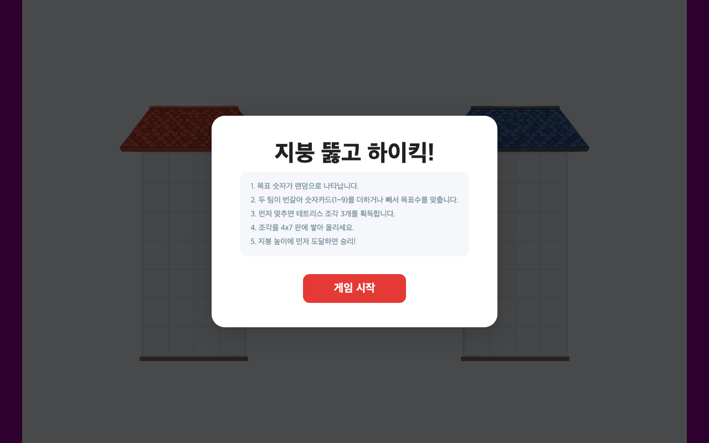

# 지붕 뚫고 하이킥! (TypingX)

> 수 연산과 도형 감각을 동시에 기르는 2인 대전형 교육 게임 — 수학 퀴즈와 테트리스를 결합한 WebGL 웹 앱

<p align="center"></p>

대화면 터치 환경(전자칠판, 태블릿)에 최적화된 교육용 게임입니다. 두 팀이 숫자 카드를 더하고 빼서 목표 숫자를 먼저 맞춘 뒤, 획득한 테트리스 조각을 쌓아 지붕에 먼저 도달하면 승리합니다.

---

## 📖 소개

`지붕 뚫고 하이킥!`은 초등 수준의 **사칙 연산(덧셈·뺄셈)** 학습을 게임 메커니즘에 녹여낸 교육용 웹 애플리케이션입니다. 단순한 계산 반복이 아니라, 두 팀이 같은 화면에서 동시에 경쟁하며 **연산 → 도형 배치 → 공간 추론**으로 이어지는 흐름을 통해 수 감각과 도형 감각을 함께 기르도록 설계했습니다.

- **수 연산 학습**: 1~9 숫자 카드와 +/- 부호를 누적 조합해 목표 숫자를 만듭니다.
- **도형/공간 감각**: 1~5칸 크기의 테트리스(펜토미노) 조각을 회전·이동하며 4×7 격자에 빈틈없이 쌓습니다.
- **2인 동시 대전**: 한 화면에서 A팀과 B팀이 동시에 플레이하는 대결 구조로 몰입감을 높였습니다.

> 참고: 프로젝트/앱 식별자는 `TypingX`(타이핑 교육 플랫폼의 한 콘텐츠)로 관리되며, 이 저장소는 그 안에 탑재되는 단일 게임 콘텐츠입니다.

---

## ✨ 주요 기능

- **3단계 게임 흐름 (`start → math → tetris → win`)**
  - **카드 뒤집기**: 각 팀이 자신의 목표 숫자 카드를 터치해 공개 (양수 +20~+60 / 음수 -10~-20)
  - **수 연산 단계**: 부호(+/-) + 숫자(1~9) 누적 계산으로 목표 숫자에 먼저 도달
  - **테트리스 단계**: 승리한 팀이 조각 3개를 회전·이동하며 격자에 배치
- **테트리스 배치 엔진**: 90° 회전, 4방향 이동, 겹침 방지, 접지(바닥/기존 블록 위) 검증, 항상 배치 가능한 조각만 생성
- **승리 판정 로직**: 바닥(row 0)부터 연속으로 완전히 채워진 행만 높이로 인정하여 지붕 도달 여부 판단
- **WebGL 3D 렌더링**: Three.js `OrthographicCamera` 기반 2.5D 빌딩 격자 렌더링
- **사운드 & 이펙트**: Tone.js 신디사이저 효과음(카드 뒤집기·정답·배치·승리), GSAP 애니메이션, canvas-confetti 승리 연출
- **반응형 캔버스 레이아웃**: `ResizeObserver` 기반으로 기준 해상도(1200×800)를 유지하며 화면 비율에 맞춰 자동 스케일링
- **데이터 기반 구성**: 격자 크기·목표 범위·색상·텍스트·문구를 `data.json`에서 외부 주입 (코드 수정 없이 튜닝 가능)
- **부모 프레임 연동**: iframe 임베드 환경을 위한 `postMessage` 프로토콜 — 하트비트(ping/pong), 캔버스 썸네일 캡처, 해상도 질의, 런타임 에러 배치 리포트

---

## 🛠 기술 스택

| 구분 | 기술 |
|------|------|
| 언어 | TypeScript (ES2020 타깃), 컴파일된 `main.js` 배포 |
| 3D / 렌더링 | [Three.js](https://threejs.org/) `0.170.0` (WebGL, OrthographicCamera) |
| 애니메이션 | [GSAP](https://gsap.com/) `3.12.5` |
| 오디오 | [Tone.js](https://tonejs.github.io/) `14.7.39`, Howler `2.2.4` |
| 이펙트 | canvas-confetti `1.9.3` |
| 유틸 | mathjs `14.5.2`, html-to-image `1.11.13` (썸네일 캡처) |
| 물리(선택) | cannon-es `0.20.0` |
| 모듈 로딩 | 브라우저 네이티브 ESM + `importmap` (CDN: jsdelivr), 빌드 도구 불필요 |

> 모든 외부 라이브러리는 번들러 없이 HTML의 `<script type="importmap">`을 통해 CDN에서 직접 로드합니다. 별도의 `npm install` 과정이 필요 없습니다.

---

## 🚀 실행 방법

이 프로젝트는 **빌드 결과물(`main.js`)이 저장소에 포함된 정적 브라우저 앱**입니다. `package.json`이 없으며, 정적 파일 서버로 폴더를 서빙한 뒤 `index.html`을 열면 바로 실행됩니다. (`importmap`과 ESM 모듈 로딩 때문에 `file://`로 직접 여는 것이 아니라 **HTTP 서버를 통해** 열어야 합니다.)

### 방법 1 — npx serve (권장)

```bash
# 저장소 루트에서
npx serve .
# 출력된 주소(예: http://localhost:3000)를 브라우저에서 열기
```

### 방법 2 — Python 내장 서버

```bash
python3 -m http.server 8080
# http://localhost:8080 접속
```

### 방법 3 — VS Code Live Server

VS Code에서 `index.html`을 열고 우클릭 → **Open with Live Server**.

> TypeScript 원본(`app.ts`, `main.ts`, `appHelper.ts`)을 수정한 경우, `tsconfig.json` 설정으로 다시 컴파일하여 `main.js`를 갱신하면 됩니다 (`npx tsc`).

---

## 📂 프로젝트 구조

```
typingx-roof/
├── index.html            # 진입점. importmap, 에러 리포트 래퍼, 캔버스/UI 레이어
├── main.ts / main.js     # 부트스트랩: 캔버스 레이아웃·리사이즈, 부모 postMessage 연동
├── app.ts                # 핵심 게임 로직 (RoofKickApp 클래스 — 상태머신·렌더링·연산·테트리스)
├── appHelper.ts          # 데이터 로딩, 좌표 변환, 플랫폼 감지, 캔버스 캡처 유틸
├── style.css             # 전체 화면 캔버스 레이아웃 스타일
├── data.json             # 게임 설정 데이터 (격자·목표 범위·색상·텍스트)
├── app_metadata.json     # 앱 메타데이터 (제목·카테고리·설명)
├── tsconfig.json         # TypeScript 컴파일 설정
├── LOGIC.txt             # 게임 로직 기획/명세서
├── assets/               # 이미지·오디오 리소스 (bgm, 효과음, 지붕 텍스처, 아이콘)
└── archive/              # 버전별 개발 스냅샷 (v1 ~ v36) + change_log.json
```

### 핵심 설계 포인트

- **`RoofKickApp` 단일 클래스 상태 머신**: `GamePhase`(`start`/`math`/`tetris`/`win`)를 중심으로 화면 전환, 팀별 격자 상태(`team1Grid`/`team2Grid`), 연산식, 테트리스 조각 풀을 관리합니다.
- **렌더링/UI 분리**: WebGL 캔버스(`#appCanvas`)는 3D 빌딩을, DOM `#uiLayer`는 버튼·텍스트 UI를 담당하는 2-레이어 구조입니다.
- **에러 텔레메트리**: `index.html`에 런타임 에러를 5초 단위로 배치 수집해 부모 프레임으로 전송하는 경량 모니터링 래퍼가 내장되어 있습니다.

---

## 📜 버전 히스토리

`archive/` 디렉터리에는 **v1-1부터 v36-1까지 36개 버전(총 38개 스냅샷)**에 이르는 반복 개발 기록이 보존되어 있습니다. 각 버전 폴더는 해당 시점의 전체 소스(`files/`)와 `meta.json`을 포함하며, `archive/change_log.json`에 버전별 변경 요약과 타임스탬프, 부모-자식 관계가 기록되어 있습니다.

초기 버전("30을 잡아라!")의 단순한 숫자 선택형 연산 게임에서 출발해, 2팀 동시 대전·테트리스 도형 배치·3D 렌더링·사운드 연출이 단계적으로 더해지며 현재의 "지붕 뚫고 하이킥!"으로 발전한 **점진적·실험적 개발 과정**을 그대로 확인할 수 있습니다.
